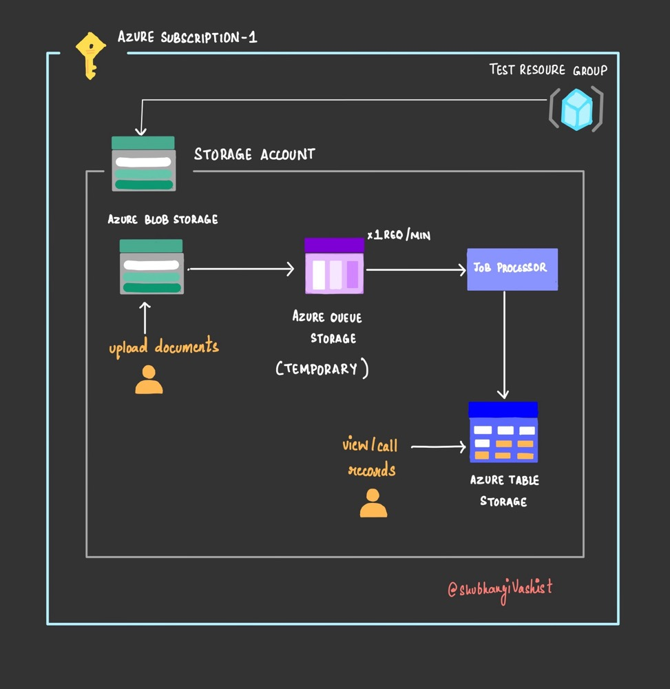

# Rate limiting - Queue-Based Load Leveling pattern on cloud

Implement a simple architecture to understand the concept of [Rate limiting](https://shubhangivashist.medium.com/queue-based-load-leveling-pattern-in-cloud-hosted-applications-039b2ad8f378) leveraging Azure cloud platform.  

## Architecture 

- GitHub for Version control.
- Azure Blob Storage to store our documents.
- Azure Queue Storage to implement rate limiting.
- Azure Table Storage to store URL for documents and associated metadata. 
- [Python](https://learn.microsoft.com/en-us/azure/developer/python/sdk/azure-sdk-overview) for our Infrastructure as Code.

## You'll need

- [Azure account](azure.com/free)
- [GitHub account](github.com/join)

For local developer environment

- VS Code/ Jupyter notebook
- Docker (optional)

## How to get started

### Get the code and environment

1. [Fork the repository](https://docs.github.com/pull-requests/collaborating-with-pull-requests/working-with-forks/about-forks) so you can have your own copy of it. 
2. If you don't already have Jupyter notebook installed, navigate to [python](https://jupyter.org/) and download the latest version. Follow the installation instructions for the setup.
3. Open [main.py](main.py) and [defaults.py](defaults.py) in Jupyter notebook. 
4. Replace the parameters in [defaults.py](defaults.py) with your own subscription ID, principle ID and resource-group name.
5. Now execute main.py to build the sample architecture.

### Authenticate your Environment with Azure
In the Terminal, type `az login --use-device-code` to log into your Azure account from the az cli.

        
